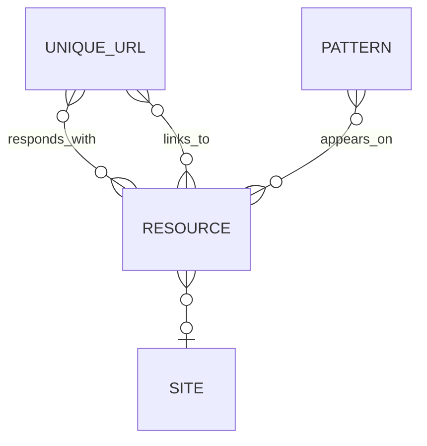

# Spidergram's Data Model

- **UniqueUrls**, **Resources**: The central entities for most work in Spidergram. They represent discovered URLs (either from your configuration or discovered by parsing other pages) and the resources that come back when the URLs are requested.
- **Sites** and **Patterns**: These entities are usually built while Spidergram is analyzing the pages that have been crawled; they represent the larger concept of a distinct web site that a page "belongs to" and individual design patterns or components that appear multiple times across many pages.
- **RespondsWith**, **LinksTo**, and **AppearsOn**: These relationships store information about the connections between the core entities. A Unique URL Responds With a Resource; a Resource Links To a URL, and a Pattern Appears On a Resource. during a default Spidergram crawl. They represent the relationship between a UniqueUrl and the Resource that it generates when visited; and the relationship between a Resource and *any* UniqueUrl that it links *to*.
- **IsChildOf** and **IsVariantOf**: Three additional relationship types that aren't populated during a default crawl, but can be used by post-crawl analysis tools to represent things like URL hierarchies, navigation hierarchies, alternate-language versions of a page, and sub-page components that are reused across many pages.
- **KeyValueStores** and **DataSets**

Custom document and relationship types can be added for project or domain-specific needs. A *Business Department* entity that connects to Resources via an *IsResponsibleFor* relationship, for example, might allow ownership information to be grafted onto the pool of Resources. A *Content* entity might track recurring instances of CMS entities that don't correspond 1:1 with a single page. Knock yourself out.
