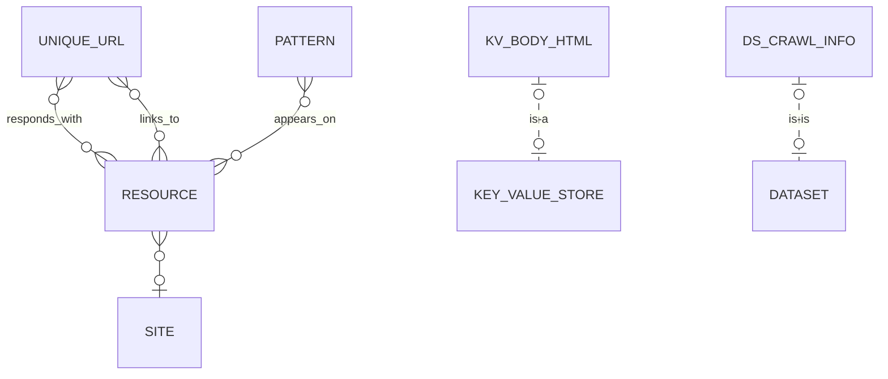

# Spidergram's Data Model

- **UniqueUrls** and **Resources**: The central documents for most work in Spidergram. They represent discovered URLs (either from your configuration or discovered by parsing other pages) and the resources that come back when the URLs are requested. If you run a crawl, you'll get this data regardless of how you've configured things.
- **Sites** and **Patterns**: Depending on your configuration settings, these documents may be created while crawled pages are analyzed. Sites are a dedicated record describing a particular logical "site" inside of the crawl structure, whether it maps to a single hostname, a subdirectory, or some other criteria. For the moment, each Resource can belong to just one Site, but that may change in the future. Patterns store information about recurring design components or sub-page elements that are reused across multiple pages.
- **RespondsWith**, **LinksTo**, and **AppearsOn**: These relationships store information about the connections between other documents. A Unique URL Responds With a Resource; a Resource Links To a URL, and a Pattern Appears On a Resource. These relationships als include lots of information about the details of the cconection; where a link appeared in the structure of a page, whether server redirects occurred during the page retrieval, what CSS classes and other data the pattern instance used, etc.
- **IsChildOf** and **IsVariantOf**: These additional relationship types aren't populated during a default crawl, but can be used by post-crawl analysis tools to represent things like URL hierarchies, navigation hierarchies, and alternate-language versions of a page.
- **KV_BODY_HTML** and **DS_CRAWL_INFO** are examples of two other types of storage — Key-Value Stores for 'named' items you need to retrieve later, and Datasets for large lists of things that share identical structure. Depending on your configuration, KV_BODY_HTML can be used to store the raw HTML of each page, keeping the Resources collection smaller and faster. DS_CRAWL_INFO is used to record starting and ending statistics whenever a crawl is run. Code that uses the Spidergram API directly can create new Datasets and Key Value Stores for custom data like imported analytics numbers, error logging, etc.

Because ArangoDB allows each of these types of documents to contain arbitrary JSON data, it's easy to (for example) add custom properties to Patterns, Pages, and Sites to describe site and project specific concepts like "What season is this page associated with?" or "What design system does this site use?"

If you're using Spidergram's API with your own custom javascript code, you can define custom document and relationship types to represent unique domain-specific ideas. A *Business Department* entity that connects to Resources via an *IsResponsibleFor* relationship, for example, might allow ownership information to be grafted onto the pool of Resources. A *Content* entity might track recurring instances of CMS entities that don't correspond 1:1 with a single page. Knock yourself out.
