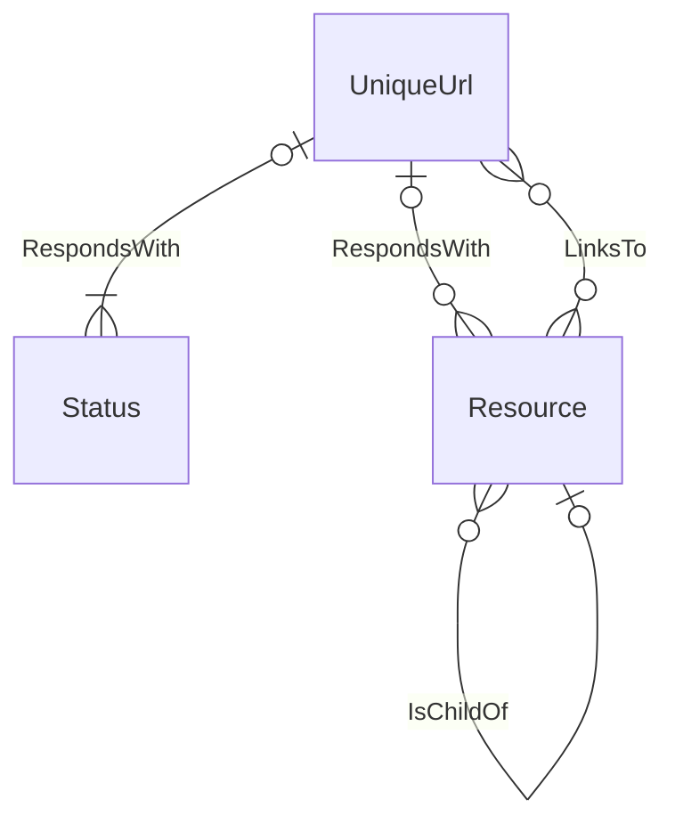
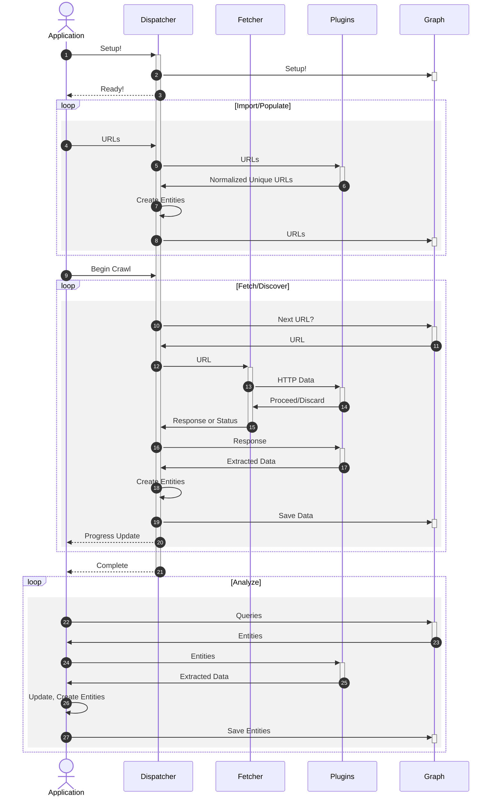
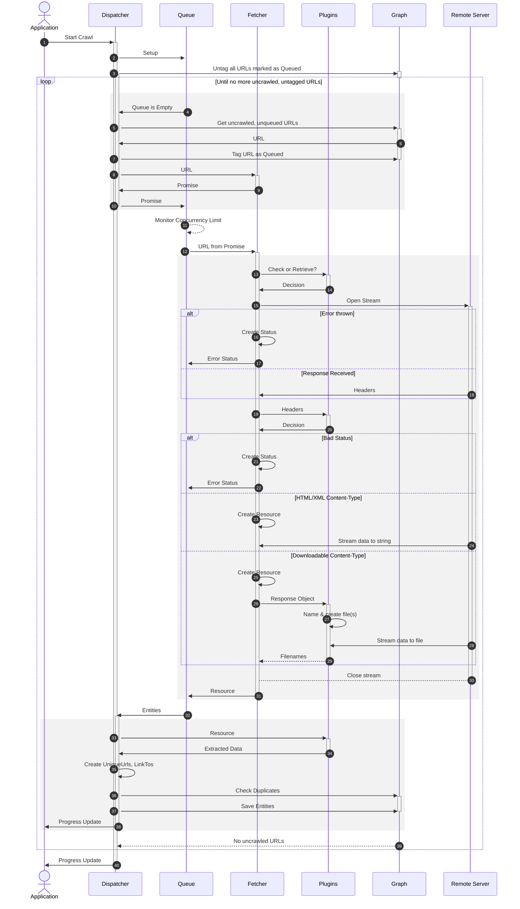

# Crawling and Fetching
Spidergram's crawling and fetching process is designed to be customized in several ways; an external application or script is expected to provide it with an already-instantiated instance of the `Graph` class to handle persistence, as well as a configuration object with a variety of `UrlFilter` and `ResourceFilter` instances to control its decisions during the crawl.

`Crawler` classes _may_ check the graph for existing uncrawled URLs, but they don't _have_ to. They can also rely entirely on incoming URL lists from the controlling application or script.

Once they have one or more URLs in hand, they take on responsibility for calling one or more `Fetcher` class. The Fetcher is expected to take in a UniqueUrl record and return a Status or Resource object, and a RespondsWith relationship connecting the Status/Resource to the original UniqueUrl. A Fetcher _may_ also return additional graph entities but should _not_ do extra discovery and parsing work that's naturally the domain of the `Crawler`.

When this is finished the `Crawler` hands all of the discovered entities back to the controlling app/script, which is responsible for persisting the entities.

## Crawl Entities

- Nodes
  - **UniqueUrl**: A normalized URL that was pre-loaded before the crawl began, or discovered by parsing retrieved resources during the crawl.
  - **Status**: A stub resource containing only the RespondsHeaders for a URL request. We use these to note that a given URL was broken when we requested it, or to gather information on URLs we encounter but don't want to fully crawl.
  - **Resource**: The information retrieved by a full web request. These are usually HTML, but could be binary files. If the crawl is configured to download linked files, they'll be saved to the filesystem and the filepath saved to the Resource. HTML is saved straight into the Resource node itself.
- Edges/Relationships
  - **RespondsWith**: Connects a UniqueUrl to a Status or a Resource. The request headers we sent when we checked the URL are saved here, in case we need to recall them later.
  - **LinksTo**: Connects a Resource that’s been parsed for links to the UniqueUrls that it references. The context in which the link occurred (page section, HTML tag attributes, etc) is saved here, so we can find and filter resources by where links to them appear in other resources.
  - **IsChildOf**: Used to construct Resource hierarchies; multiple hierarchies can be created and distinguished from each other by adding tags to it.
  - **IsVariantOf**: Resources that serve as filtered, localized, or personalized versions of another Resource. These can be used to filter out variants when constructing hierarchy maps, or to group variations for aggregate analysis.

## Crawl/Analysis Flow

## Detailed view of the Crawl Flow

