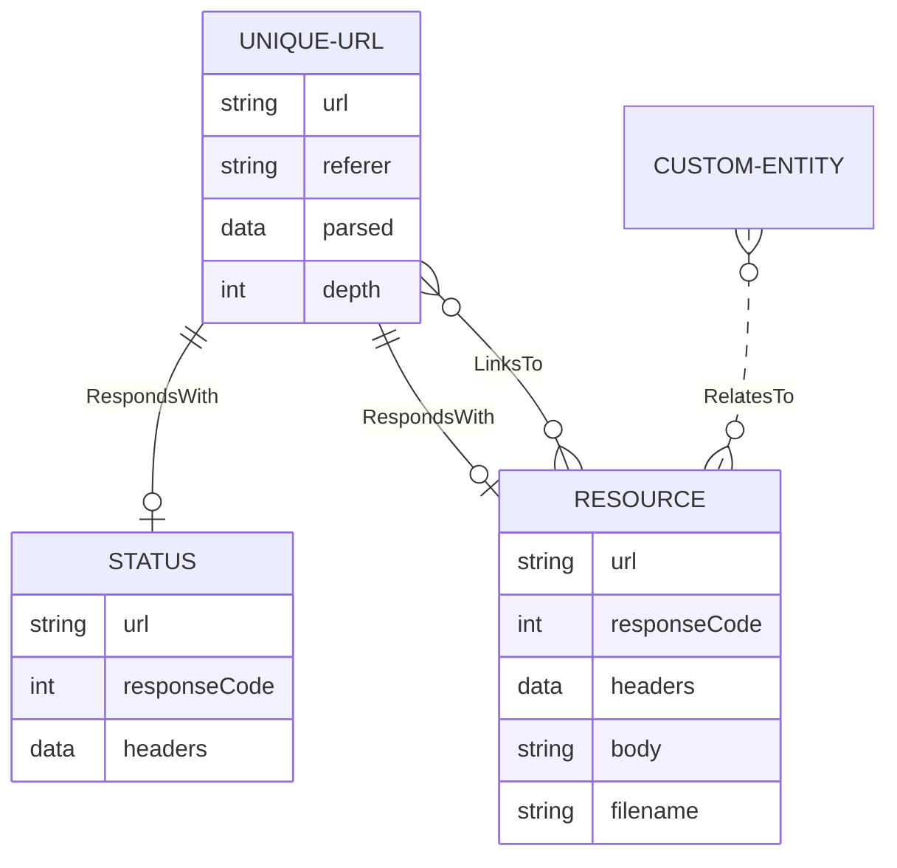

# Data Storage Overview

Spidergram's core consists of the UNIQUE-URL and RESOURCE data types, linked by RESPONDS-WITH and LINKS-TO relationships. Other Spidergram plugins add additional domain concepts and relationships to capture design pattern usage, different hierarchies for organizing the site's content, ownership of different portions of the site by individuals or groups, and more.

Because so much critical information is stored on the Resource entity it might make sense to shift its Body property to a separate Payload table, responsible for storing any large but optional properties representing the Resource's data in raw or processed form.

Smaller property data (category names, HTML metadata, etc) can be added directly to the Resource entity, but caution should be exercised.