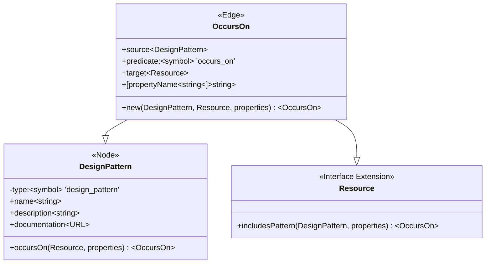

# Design Pattern Extraction

How will Spidergram tackle discovering/auditing design systems? We treat a given "Design Pattern" (or component, or whatever it's called) as a distinct type of trackable domain entity. When we find instances of it on a page we create an OccursOn edge linking the DesignPattern to the Resource; the OccursOn instances also includes any specific properties we extracted from the instance of the pattern we found in the Resource's markup.

Convenience functions exist on both DesignPattern and Resource to create a new OccursOn instance.

From a code perspective, it looks like so:

