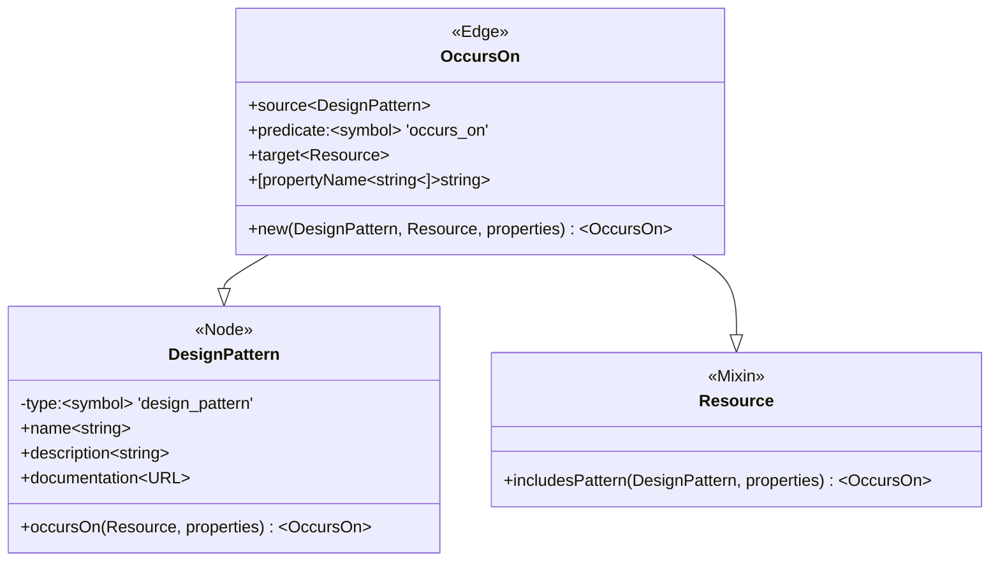

# Design Pattern Extraction

How will Spidergram tackle discovering/auditing design systems? We treat a given "Design Pattern" (or component, or whatever it's called) as a distinct type of trackable domain entity. When we find instances of it on a page we create an OccursOn edge linking the DesignPattern to the Resource; the OccursOn instances also includes any specific properties we extracted from the instance of the pattern we found in the Resource's markup.

Convenience functions exist on both DesignPattern and Resource to create a new OccursOn instance.

## Class Diagram:



A PatternExtractor function signature should also be registered by the Patterns system: 

```
PatternExtractor = Extractor<Resource, OccursOn[]>
// Alternately:
PatternExtractor = (r:Resource) => OccursOn[];
```

A PatternExtractor, given a Resource, is expected to parse it for instances of one or more design patterns, create an OccursOn object describing each instance that was found, and return them all keyed by pattern. Most PatternExtractors will probably find just one pattern, but makes support for multi-pattern extractors explicit.

This approach makes it possible to use "mega-extractors" that are responsible for many different kinds of patterns, or smaller pattern-specific ones that might be reused or repurposed.

By convention, the extra properties added to the OccursOn relationship should contain text, URLs, numerical data, and other properties that are explicitly part of the design pattern itself. For example, a CTA pattern might have a 'CTA Title', a 'Subhead,' a 'style', and a destination URL. Capturing those four pieces of information and adding them to the OccursOn object each time the pattern is encountered makes it possible to compare pattern occurrences in later analysis steps.

Some (currently speculative) example code based on the existing conventions of the codebase:

```
const cheerio = new CheerioParser();

const IbmCarbonCard:PatternExtractor = (r:Resource) => {
  const occurrences:OccursOn[] = [];
  const c = Pattern.load('Card');
  const items = cheerio.load(r.body).('$.bx--tile').forEach((element) => {
    let cardProperties = { 
      heading: ...,
      eyebrow: ...,
      copy: ...,
      image: ...,
      variation: ...,
      cta: ...
    };
    occurrences.push(c.occursOn(r, cardProperties));
  });
  return occurrences;
}
```