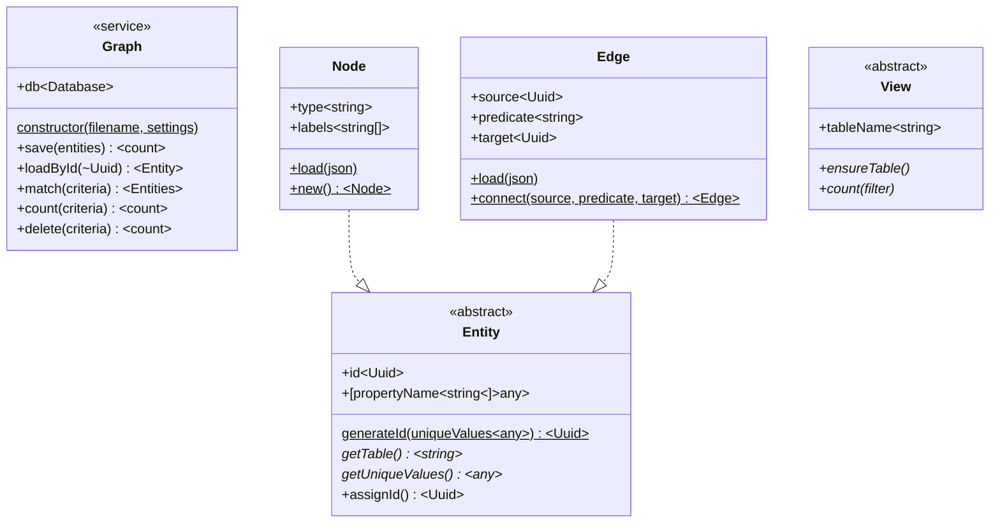

# Basic graph architecture

Version 0.x of Node-Simple-Graph breaks things down into a handful of pieces.

The central "Graph" class handles instantiating (and creating, if necessary) the database, as well as all CRUD operations. It bakes in reliance on bettersqlite3, which is suboptimal but works for now. lots of operations currently "break through" the light abstraction and require direct SQL queries, we'd like to change that.

The entities it cares about are `Nodes` and `Edges`; they both descend from the abstract `Entity` class for convenience but they're dealt with separately. Nodes are domain objects, Edges are the relationships between them. Nodes have a 'type' and an arbitrary pile of data, while Edges have a 'predicate', a 'source,' and a 'target' for the relationship they define (along with a pile of arbitrary data).

'Views' are light wrappers for SQL views, and we probably want to remove them in the future. It's just too hard to prevent performance-annihilating queries from getting baked into every operation.

